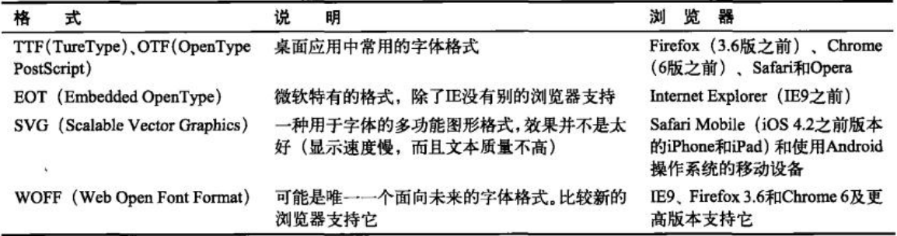

## HTML5 秘籍

* CSS:The Missing Manual by David Sawyer McFarland
* JavaScript & jQuery:The Missing Manual by David Sawyer McFarland
* [caniuse](http://caniuse.com)

### 一.认识新语言
---
#### 1.HTML简介(发展历程)
* HTML 的基本思想：使用元素为内容添加结构
* WHSTWG(What Hypertext Application Technology Working Group,Web 超文本应用技术小组)：包括 Opera、Mozilla、Apple
* HTML5 的三个主要原理：
    * 不破坏 Web [向前兼容]
    * 修补牛蹄子路 [标准化非官方但广泛应用的技术]
    * 实用至上
* HTML5 文档基本结构
```
<!DOCTYPE html>
<html lang="en">
<head>
	<meta charset="UTF-8">
	<title></title>
</head>
<body>
	
</body>
</html>
```
* 文档类型
    * 要求保留文档类型，主要是由于历史原因。
    * 如果没有文档类型声明，大多数浏览器(包括 IE 和 Firefox)会转换到一种混杂模式 - quirk mode，而且，不同浏览器的混杂模式也不一样
    * 添加了文档类型声明后，会触发浏览器的标准模式(standard mode)浏览器会以一致的格式和布局来显示网页
    * IE5.5 引入了文档模式(document mode)的概念。混杂模式会让 IE 的行为与(包含非标准特性的)IE5相同，而标准模式则让 IE 的行为更接近标准行为
* 字符编码
    * 字符编码是一种标准,计算机根据它把文本转换成保存在文档中的字节序列(或者在打开文件时再将字符序列转换成文本格式)
    * UTF-8 的特点：编码简介、转换速度快，包含非英文字符
    * HTML5 文档中添加字符编码信息:``` <meta charset="utf-8"> ```
* 页面语言
    * 搜索引擎可以通过它来筛选搜索结果，确保只向搜索者返回特定语言的页面
    * 使用 lang 属性   ``` <html lang="en"> ```
    * 对屏幕阅读器有用
* 样式表
    - ``` <link rel="" href=""> ```
    - 因为 CSS 是网页中唯一可用的样式表语言，所以 `type="text/css"` 没有必要
* JavaScript
    - ``` <script src=""> ```
    - 没有必要加上 `language="JavaScript"` 属性，因为默认就为 JavaScript
    - 如果不写 `</script>` 或者使用空元素语法，页面将不会执行加载脚本
    - IE 中在 `<head>` 中包含一行特殊注释，叫做 Web 标志(mark of Web)，这行注释要放在指定字符编码的元数据标签后面 ``` <!-- saved from url=(0014)about:internet --> ``` 。这条注释告诉 IE 将页面视为从远程网站上下载下来的，否则，IE 会切换到一种特殊的锁定模式，弹出一条安全警告，在点击了 `"允许阻止的内容"` 按钮之上才会执行 JavaScript 代码。其他浏览器会忽略这个注释
* HTML 语法
    - 放松的规则
        + 并不要求不许包含 `<html>` `<head>` `<body>` 元素
        + 不区分大小写
        + 允许省略关闭空元素(void element)的斜杠[空元素：就是不会嵌套内容的元素，包括 `` `<br>` `<hr>`]
        + 修改属性的语法规则：
            + 属性值中只要不包含受限的字符(`>` `=` ` `)，就可以不加引号
            + 只有属性名没有属性值(例如 `checked`)
        + 最佳实践
            + 包含可选的 `<html>` `<head>` `<body>` 元素
            + 标签名全部小写
            + 为属性值加引号
            + 不关闭空元素
    - HTML5 验证
        + HTML5 验证器
            * Dreamweaver、Expression Web等工具
            * [在线校验](http://validator.w3.org/)
* HTML 元素
    - 新增的元素
        
    |类别|元素|
    |---|---|
    |用于构建页面的语义元素|article,aside,figcaption,figure,footer,header, <br> hgroup,nav,section,details,summary|
    |用于标识文本的语义元素|mark,time,wbr(正式列入规范)|
    |Web 表单及交互|input(新的类型),datalist,keygen,meter, <br> progress,command,menu,output|
    |音频视频及插件|audio,video,source,embed(正式列入规范)|
    |canvas|canvas|
    |非英语支持|bdo,rp,rt,ruby|


    - 删除的元素

    |类别|元素|
    |---|---|
    |表现性元素|big,center,font,tt,strike|
    |HTML 框架|iframe 保留|
    |冗余或者容易导致误会|acronym(被abbr代替),applet(有更好的 object)|

    - 改变的元素(旧元素用于新的目的)

    |元素|代表意义|默认样式|
    |---|---|---|
    |small|附属细则(small print)|稍小的字体|
    |hr|水平线(horizontal rule)，表示主题转换|在两个区块间画一条线|
    |s|struck text,删除的文本，表示不再准确或不再相关的内容|给文本加一条删除线|
    |strong|重要的文本|粗体|
    |b|粗体表示的文本，并不一定重要|粗体|
    |em|重读的文本，朗读时要大声读出来|斜体|
    |i|应该用斜体表示的文本|斜体|

    - 调整的元素

    |元素|代表意义|
    |---|---|
    |address|提供 HTML 文档作者的联系信息|
    |cite|引用的作品|

    - 标准化的元素

    |元素|代表意义|
    |---|---|
    |embed|页面中加入插件|
    |wbr|表示在某处换行|

* 浏览器装机情况统计：[GlobalStats](http://gs.statcounter.com)
* 通过 Modernizr 检测功能：[Modernizr](http://www.modernizr.com)
* 腻子脚本(polyfill)：填平旧浏览器对 HTML5 支持上的缺陷

#### 2.构造网页的新方式(HTML5 的语义元素 - semantic element)
* div(division，分区)
* 语义元素(semantic element):为标注的内容赋予额外的意义。所有语义元素都有一个显著的特点，不真正做任何事
* 使用理由：
    - 容易修改和维护
    - 无障碍性
    - 搜索引擎优化
    - 未来的功能(例如内容纲要，搜索 Chrome 插件 html5 outliner)
* 使用 HTML5 构造网页
    - header,footer,article
    - hgroup(副标题，包含多个 h 元素)
    - figure(插图),figcaption
    - aside(附注)
    - nav(导航链接)
    - details,summary(折叠块)
    - section(区块)
* 浏览器支持情况(对于不支持某些语义元素的浏览器，只需要让浏览器把它们当做普通的 `<div> `元素就行了)
    - 浏览器天生把不认识的元素当成内联元素(inline)，而大多数 HTML5 予以元素(除了 `<time>`)，都是块级元素
    ``` CSS
    article, aside, figure, figcaption, footer, header, hgroup, nav, section, summary { display: block; }
    ```
    - 对于 IE8 及更早版本，会拒绝给无法识别的元素应用样式：需要通过 JavaScript 创建新元素(可以使用成熟的解决方案，注意条件引入)
    ``` JS
    <!-- [if lt IE 9]>
        <script src="http://html5shim.googlecode.com/svn/trunk/html5.js"></script>
    <![endif] -->
    ```
    - 使用 Modernizr
* HTML5 纲要(document outline) - 根据标题元素(h1 ~ h6)添加缩进
    - [在线 HTML 纲要生成器](http://gsnedders.html5.org/outliner)
    - [Chrome 扩展](http://code.google.com/p/h5o)
    - Opera 扩展

#### 3.有意义的标记(语义，微数据 - microdata)
* 语义就是为标记赋予某种意义，然后可以在不同的标记中放入不同的信息
* 文本级语义：用于描述较小的一些内容片段
* 文本级语义元素
    - time 
    > 表示日期和时间位于标记中的哪个地方
    > 以任何软件都能理解的方式提供日期和时间
    > pubdate 属性可以对应一个发表日期
    - output
    > 标注 JavaScript 的返回值
    - mark
    > 标注文本以突出显示
    > 默认添加黄色背景
* tips
    - 生成上标 `<sup></sup>`
* ARIA(Accessible Rich Internet Application,无障碍富因特网应用)
    - 规定了在任意 HTML 元素上使用的属性，通过这些属性可以为屏幕阅读器提供额外的信息
    - role 属性，表示所在元素的用途 ``` <header role="banner"></header> ```
    - aria-required/aria-invalid
* RDFa(Resource Description Framework,资源描述框架)
    - 是一种使用属性向网页中嵌入详细信息的标准
    - 优缺点：
    > 优点：是一个稳定不变的标准
    > 缺点：复杂；针对 XHTML 而非 HTML5
* Microformats

### 二.制作新网页
---

#### 4.Web 表单(HTML5表单元素的变化)
* form 元素用于组织所有表单部件，负责告诉浏览器把数据提交到哪里，方法是在 action 属性中提供一个 URL
* HTML5 也可以使用新的 form 属性引用表单的 ID 值，以支持把表单控件放在它所在的表单外面
* 元素
    - fieldset
    - legend
* tips
    - 按钮的类型
    > `<input type="submit">`
    > `<input type="image">`
    > `<input type="reset">`
    > `<input type="button">`
* 占位符 - placeholder
    - 不支持的浏览器可以是用 JS 补丁:http://tinyurl.com/polyfills
    - 改变样式:`-webkit-input-placeholder` `-moz-placeholder`
    - 作用：消除歧义；用于真是输入值的一个示例；可以用来表示值的格式
    - 避免：用来替代字段描述或说明；不要选择特殊字符(容易让人迷惑)
* 焦点 - autofocus(只能为一个 input 或者 textarea 元素添加)
    - JS 补丁:http://tinyurl.com/polyfills
* 验证
    - 验证原理：告诉浏览器要验证哪个字段，而由浏览器去决定验证细节
    - required
    - 客户端验证(为访客提供方便)和服务器端验证(确保数据的正确性)
    - HTML5 表单验证
        + 点击 "提交" 按钮，才会触发浏览器从上到下的验证表单数据
        + 一旦发现一个无效的值，就会停下来，不再继续验证
        + 取消提交操作，并在无效值的旁边显示一条错误信息(如果有问题的文本框不再当前视口中，则浏览器会滚动到它正好位于页面顶部)
    - 关闭验证：表单增加 novalidate 属性；submit 元素添加 formnovalidate 属性
    > `<form novalidate>`
    > `<input type="submit" value="submit" formnovalidate>`
    - 验证样式挂钩(伪类)
        + required/optional
        + valid/invalid
        + in-range/out-of-range/
    - 正则表达式验证 - pattern
        + 不必使用 `^` 和 `$` 字符表示要匹配字段值得开头和结尾，HTML5 会自动确保这一点。也就是说正则表达式匹配的是字段中完整的值，验证的也是整个值的有效性 
    - 自定义验证
    ``` 
    <!-- HTML -->
    <label for="comments">When did you first know you wanted to be a zookeeper?</label>
    <textarea id="comments" oninput="validateComments(this)"></textarea>

    // JS
    function validateComments() {
        if(input.value.length < 20) {
            input.setCustomValidity('You need to comment in more detail.');
        } else {
            input.setCustomValidity('');
        }
    }
    ```
* HTML5 的几个特殊的输入属性
    - spellcheck - true/false
    - autocomplete - on/off
    - autocorrect,autocapitalize(iPad 和 iphone 中的 safari 使用)
    - multiple
* 浏览器遇到不认识的 `<input>` 元素类型(type 属性值)，会将其作为一个普通的文本框来处理。HTML5 利用这个默认处理方式，为 `<input>` 增加了新的类型 .这样做的优点：
    - 提供便于编辑的辅助
    - 限制可能出现的错误
    - 执行验证
    - 类型
        + `email`
        + `url` 
        + `search`
        + `tel`
        + `number` (`min` `max` `step`)
        + `range` (`min` `max`)
        + `datetime` `date` `month` `week` `time`
        + `color`
* 输入建议 `<datalist>`
``` HTML
<input type="text" id="favoriteAnimal" list="animalChoices">
<datalist id="animalChoices">
    <option label="Alpaca" value="alpaca"></option>
    <option label="Alpaca" value="alpaca"></option>
    <option label="Alpaca" value="alpaca"></option>
    <option label="Alpaca" value="alpaca"></option>
</datalist>
```
* 进度条和计量条 `<progress>` `<meter>`
* 工具条和菜单 `<command>` `<menu>`
* 网页中的 HTML 编辑器 `contentEditable`(编辑元素) `designMode`(on/off，编辑整个页面，页面放在 iframe 中)

#### 5.音频与视频(audio,video)
* audio
``` HTML
<audio src="" controls></audio>
    - preload(auto - 下载整个文件,metadata - 获取音频文件的开头的数据块，从而足以确定一些基本信息,none - 不必预先下载)
    - autoplay(浏览器加载完音频文件后立即播放)
    - loop(浏览器在音频播放到达末尾时，再从头开始重新播放)
```
* video
    - preload, autoplay, loop
    - height
    - width
    - poster(设置替换视频的图片)。浏览器在下列情况会使用这个图片：
        + 视频第一帧未加载完毕
        + 把 preload 属性设置为 none
        + 没有找到指定的视频文件
* audio 和 video 的两个未得到任何浏览器支持的属性
    - muted：一开始就关闭声音
    - mediagroup：把多个媒体文件链接到一起
* 解决不同浏览器支持格式不一致的方案(浏览器会选择播放第一个它所支持的文件)
``` HTML
<audio controls>
    <source src="a.mp3" type="audio/mp3">
    <source src="a.ogg" type="audio/ogg">
</audio>
<video controls width="700" height="400">
    <source src="a.mp4" type="video/mp4">
    <source src="a.ogv" type="video/ogv">
</video>
```
* 浏览器对待不认识的标签时的行为都一样：视而不见。但是浏览器不会忽略不认识的元素中包含的内容。支持 HMTL5 的音频的浏览器即使不能播放媒体文件，也会忽略后备内容。

#### 6.基本 Canvas 绘图(canvas)
* 富应用的含义包括漂亮的图片、人机互动功能以及炫目的动画效果
* canvas 独特的地方就是需要 JS 来操作，这就意味着 canvas 是一个编程工具，而这已然超出了 Web 基于文档的设计初衷
* 属性：`id` `width` `height`
* 默认的， canvas 会在页面上显示一块空白、无边框的矩形
* 画布的坐标系
* 画直线：moveTo(), lineTo(), stroke(), lineWidth, strokeStyle, lineCap, beginPath() - 每次开始新路径时，原来的路径就会自动 "完成"
* 
* 

#### 7.高级 Canvas 技术()

#### 8.使用 CSS3()
* 开发商前缀(vendor prefix)：为还在开发中的 CSS 属性和功能加上特定浏览器实现的前缀。
    - -moz-
    - -webkit-
    - -ms-
    - -o-
* Web 字体
    - 安全字体：已知的所有浏览器和操作系统都支持的字体
    - CSS3 通过 @font-face 为浏览器增加了强大的字体功能
    - Web 字体格式
    
    - [下载字体包](http://www.fontsquirrel.com/fontface)
    - 使用格式
    ```CSS
    @font-face {    /* @font-face 是正式注册字体的工具，注册之后才能使用 */
        font-family: 'ChantelliAntiquaRegular';     /* 给字体注册名字 */
        src: url('Chantelli_Antiqua-webfont.eot');  /* 先注册 eot，给 IE 使用。url() 函数用于高速浏览器在当前位置下载另一个文件 */
        src: local('Chantelli Antiqua'),            /* 如果当前系统安装了这种字体，浏览器就会使用它 */
            url('Chantelli_Antiqua-webfont.woff') format('woff'),
            url('Chantelli_Antiqua-webfont.ttf') format('ttf'),
            url('Chantelli_Antiqua-webfont.svg') format('svg'),     /* 高速浏览器可以使用的其他文件格式 */
    }
    ```
* 多栏文本(IE9不支持)
``` CSS
article {
    text-align: justify;
    -moz-column-count: 3;
    -webkit-column-count: 3;
    column-count: 3;    /* Opera */
}

article {
    text-align: justify;
    -moz-column-width: 10em;
    -webkit-column-width: 10em;
    column-width: 10em;
}
```
    - column-count(栏数),column-width(栏宽),column-gap(栏间距),column-rule(分隔线) - 高级特性暂时还没有浏览器支持
    - 使用 em：em 单位与当前字体大小是匹配的。具体来说，1em 等于两倍字体大小：1em = 2*px
* 媒体查询(media query)
``` CSS
<link rel="stylesheet" media="screen" href="style.css">
<link rel="stylesheet" media="print" href="print-style.css">
```
    - 就是取得查看页面的设备的关键信息(大小、分辨率、色深等等)，根据该信息应用不同的样式，甚至更换完全不同的样式表
    - 格式：@media (media-query-property-name: vlaue) { /* new style */ }
    - 相关属性：max-device-width(用于创建移动版网页),max-width(根据浏览器窗口当前大小改变样式),orientation(视 iPad 横放或竖放来切换布局)
    - [完整属性](http://www.w3.org/TR/css3-mediaqueries);
    - 关于 max-device-width 和 max-width：在识别上网手机时，要使用 max-device-width 而不是 max-width 属性。因为 max-width 属性时手机视口的宽度，而视口就是手机用户可以滚动页面的区域。通常，手机屏幕中视口的宽度是实际屏幕宽度的2倍。
    - 高级媒体查询
        + 多个条件 and：@media (min-width: 400px) and (max-width: 700px) { 400 - 700}
        + 多个条件 not: @media (not max-width: 600px) and (max-width: 700px) { 600 - 700 }
    - 替换整个样式表
    ``` HTML
    <link rel="stylesheet" media="(max-width: 480px)" href="style.css">
    ```
* 识别移动设备
``` HTML
<!-- 宽度值匹配 iPhone 和 Android 系统的手机 -->
<link rel="stylesheet" media="(max-device-width: 480px)" href="mobile-style.css">
<!-- 匹配 iPhone 4 -->
<link rel="stylesheet" media="(max-device-width: 480px) and (-webkit-min-device-ratio: 2)" href="">
<!-- 匹配 iPad -->
<link rel="stylesheet" media="(max-device-width: 768px) and (orientation: landscape)" href="">
```
    - 针对手机设置媒体查询，可以设置 max-device-width 为 480px
    - iPhone 4 虽然屏幕分辨率为 960px*640px，仍然告诉浏览器自己的宽度为 480px。像素比为2
    - 像素比：真实像素与报告像素之间的比率。
* 多变的盒子
    - 透明盒子
        + rgba() 函数: .box { background: rgb(170, 240, 0); rgba(170, 240, 0, 0.5); }
        + opacity 属性: .box { background: rgb(170, 240, 0); opacity: 0.5; }
        + 建议下列情况使用 opacity 属性而不是 rgba() 函数
            * 实现多种颜色(元素)的半透明效果
            * 在不知道颜色的情况下，实现半透明效果(使用其他样式表或者JS代码来设置)
            * 实现图片的半透明效果
            * 实现渐变动画效果时
    - 圆角盒子(border-radius)
        + 问题：1.圆角效果；2.画圆、椭圆
    - 背景盒子：多背景
    ``` CSS
    /* 多背景 */
    .box {
        background-image: url('top-left.png'), url('bottom-right.png');
        background-position: left top, right bottom;
        background-repeat: no-repeat, no-repeat;
    }
    ```
    - 阴影盒子
    ``` CSS
    .box {
        border: thin #369 solid;
        border-radius: 25px;
        box-shadow: 5px 5px 10px gray;
    }
    ```
        + 盒子阴影：box-shadow:(水平偏移量，垂直偏移量，模糊距离 - 阴影的模糊成都，[伸展范围 - 增大模糊边界之前的实心面积]，[inset - 元素内部或外部创建阴影])
        + 文本阴影：text-shadow:(颜色值，水平偏移量，垂直偏移量，模糊值)
    - 渐变盒子(IE >= 10)
    ``` CSS
    .box { 
        background: white;
        /* 线性渐变 */
        background: -moz-linear-gradient(top, white, blue);
        background: -moz-linear-gradient(top left, white, blue);
        background: -moz-linear-gradient(top, red 0%, orange 20%, yellow 80%, wiolet 100%); 
        /* 放射性渐变 */
        background: -moz-radial-gradient(circle, white, lightblue);
    }
    ```
        + 线性渐变：沿直线混合几种颜色
        + 放射性渐变：圆心到圆周之间混合颜色
* 创建过渡效果(transition)
``` CSS
.btn {
    -webkit-transition: background 0.5s, color 0.5s;
    -moz-transition: background 0.5s, color 0.5s;
    -o-transition: background 0.5s, color 0.5s;
    /*
    -webkit-transition: all 0.5s;
    -moz-transition: all 0.5s;
    -o-transition: all 0.5s;
    */
}
```
    - 需要跟伪类 :hover 结合使用
    - 使用逗号分隔或者使用 all
    - 可以把过渡效果跟 透明度、阴影、渐变、变形相结合
    - 不建议对内边距、外边距和字体大小应用过渡。因为会导致浏览器重新计算布局大小或文本提示，可能导致响应迟钝和卡壳
* 变换(transform)
``` CSS 
.box {
    -moz-transform: rotate(45deg);
    -webkit-transform: rotate(45deg);
    -o-transform: rotate(45deg);
}
```
    - 变换包括移动(scaleX,scaleY)、缩放(scale)、斜切(skew)和旋转(rotate)
    - 变换不会影响页面中的其他元素，也不会影响布局

### 三.构建桌面式 Web 应用
---

#### 9.数据存储(新的 Web 存储功能)
#### 10.离线应用(新的 HTML5 缓存功能)
#### 11.与 Web 服务器通信(XMLHttpRequest，服务器事件，Web 套接字)
#### 12.更酷的 JavaScript 技术(地理定位，Web Worker，新的浏览器历史功能)


