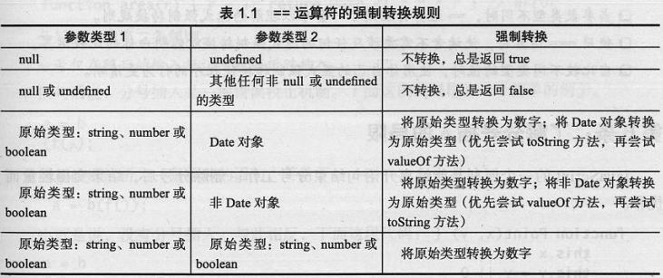

# Effective JavaScript:68 Specific Ways to Harness the Power of JavaScript

* 语法、形式和结构：编写合法的、符合语义的、具有意义和行为正确的而程序；
* 语用：使用语言特性构建高效程序的方法。

## 第1章 让自己习惯 JavaScript 

### 1.了解你使用的 JavaScript 版本
* ES5 引入了一种版本控制考量 - 严格模式(strict mode)。允许选择在受限制的 JavaScript 版本中禁止使用一些 JavaScript 语言中问题较多或较易于出错的特性。
> 'use strict'; 
    - 只有在脚本或者函数顶部才能生效
    - 由于在连接文件上可能造成的错误，建议把功能放在立即执行函数(IIFE)内部，并在函数中使用严格模式

### 2.理解 JavaScript 的浮点数
* JavaScript 中的所有数字都是双进度浮点数
* 对于位运算符，JavaScript 不会直接将操作数作为浮点数进行计算，而是会将其隐式的转换为32位整数后进行计算。
    - 将操作数转换为整数
    - 使用整数位模式进行计算
    - 将结果转换为标准的 JavaScript 浮点数

### 3.当心隐式的强制转换
* 算术运算符 -,*,/,% 在计算之前都会尝试将其参数转换为数字
* 运算符 + 既重载了数字加，又重载了字符串连接操作 
* 位操作符 ~,&,^,|,<<,>>,>>> 会将操作数转换为32位整数
* 结果为 null 的变量会被隐式的转换为0
* 未定义的变量会被转换为特殊的浮点数值 NaN
    - NaN 不等于其本身(可用于测试 NaN)
    - isNaN() 方法会在测试前将参数转换为数字
* 对象通过隐式的调用本身的 toString() 方法转换为字符串(例如 + 操作时)
* 对象可以通过其 valueOf() 方法转换为数字(使用 + 操作符时，会默认调用 valueOf() 方法)。因此，具有 valueOf 方法的对象应该实现 toString 方法，返回一个 valueOf 方法产生的数字的字符串表示
```JS
var obj = {
	toString: function() {
		return '2';
	},
	valueOf: function() {
		return 2;
	}
}
```
* 真值运算：JS 中的7个假值 - false,0,-0,'',NaN,null,undefined 
* 检查参数是否为 undefined 的方式是使用 typeof 或者与 undefined 作比较(=== undefined)

### 4.原始类型优于封装类型
* 5个原始对象：布尔值、数字、字符串、null 和 undefined
* typeof null 返回 'object'
* 标准库提供了构造函数来封装布尔值、数字和字符串作为对象。当做相等比较时，原始类型的封装对象与其原始值的行为不一样
```JS
console.log('a' === 'a');   // true
console.log(new String('a') === new String('a'));   // false
```
* 获取和设置原始类型值的属性会隐式的创建封装对象。[执行过程：每次隐式封装都会产生一个新的对象，更新封装对象并不会造成持久的影响]
```JS
'hello'.someProperty = 17;
console.log('hello'.someProperty);  // undefined
```

### 5.避免对混合类型使用  == 运算符
* 使用严格相等运算符 ===：在比较操作中没有涉及任何转换
* == 运算符的强制转换规则


### 6.了解分号插入的局限(?)
* 自动分号插入(automatic semicolon insertion)技术是一种程序解析技术。能推断出某些上下文中省略的分号，然后有效的自动将分号插入的程序中。
* 分号插入规则：
    - 分号仅在 `}` 标记之前，一个或多个换行之后和程序输入的结尾被插入。也就是说： 只能在一行、一个代码块和一段程序结束的地方省略分号
    - 分号仅在随后的输入标记不能解析时插入。也就是说，分号插入是一种错误校正机制

### 7.视字符串为16 位的代码单元序列(?)
* Unicode：为世界上所有的文字系统的每个字符单位分配了一个唯一的整数，该整数介于0和1114111之间，在 Unicode 术语中称为代码点(code point)
* 

## 第2章 变量作用域

### 8.尽量少用全局变量
* JS 中很容器创建全局变量：不加任何形式的声明，而且能被整个程序的所有代码自动的访问
* 全局变量的问题：
    - 会污染共享的公共命名空间，并可能导致意外的命名冲突
    - 不利于模块化，因为会导致程序中独立组件间的不必要耦合
* 全局命名空间是 JS 程序中独立的组件进行交互的唯一途径
* JS 的全局命名空间也被暴露为在程序全局作用域中可以访问的全局对象，该对象作为 this 关键字的初始值。在 Web 浏览器中，全局对象被绑定到全局的 window 变量
```JS
var foo = 123;
console.log(this.foo);
console.log(window.foo);

this.foo = 'abc';
console.log(foo);
```
* 创建全局变量的方式：
    - 在全局作用域内使用 var 声明
    - 将变量加入到全局对象中
* 利用全局对象来做平台特性检测

### 9.始终声明局部变量
* 程序中给一个未绑定的变量赋值将会创建一个新的全局变量并赋值给它(省略 var 时会隐式的创建全局变量)

### 10.避免使用 with(?)
* with 语句的动机：程序中需要对单个对象依次调用一系列方法，使用 with 可以很方便的避免对对象的重复引用
```JS
function status(info) {
    var widget = new Widget();
    with(widget) {
        setBackground('blue');
        setForeground('white');
        setText('Status: ' + info);
        show();
    }
}

function f(x, y) {
    with(Math) {
        return min(round(x), sqrt(y));
    }
}
```

### 11.熟练掌握闭包
* 闭包的3个事实：
    - JS 允许引用在当前函数以外定义的变量
    ```JS
    function makeSandwich() {
        var magicIngredient = 'peanut butter';

        function make(filling) {
            return magicIngredient + ' and ' + filling;
        }

        return make('jelly');
    }
    makeSwidwich();
    ```
    - 即使外部函数已经返回，当前函数仍然可以引用在外部函数所定义的变量。意味着可以返回一个内部函数，并稍后调用
    > 原理：JS 的函数值包含了比调用它们时执行所需要的代码还要多的信息。而且，JS 函数值还在内部存储它们可能会引用的定义在其封闭作用域的变量。那些在其所涵盖的作用域内跟踪变量的函数被称为闭包。
    > 函数可以引用在其作用域内的任何变量，包括参数和外部函数变量。
    
    ```JS
    function makeSandwich() {
        var magicIngredient = 'peanut butter';

        function make(filling) {
            return magicIngredient + ' and ' + filling;
        }

        return make;
    }
    var f = makeSwidwich;
    f('jelly');
    f('bananas');
    f('marshmallows');
    ```
    - 闭包可以更新外部变量的值。闭包存储的是外部变量的引用，而不是值的副本。
    ```JS
    // 此方法产生了包含三个闭包的对象
    function box() {
        var val;

        return {
            set: function(newVal) { val = newVal; },
            get: function() { return val; },
            type: function() { return typeof val; }
        };
    }

    var b = box();
    b.type();
    b.set(23);
    b.get();
    b.type();
    ```
* 闭包是 JS 最优雅、最有表现力的特性之一，也是许多惯用法的核心。JS 甚至提供了一种更为方便的构建闭包的字面量语法 - 函数表达式
```JS
function sandWichMaker(magicIngredient) {
    return function(filling) {
        return magicIngredient + ' and ' + filling;
    };
}
```

### 12.理解变量声明提升(P47)

## 第3章 使用函数
## 第4章 对象和类型 
## 第5章 数组和字典 
## 第6章 库和 API 设计 
## 第6章 并发