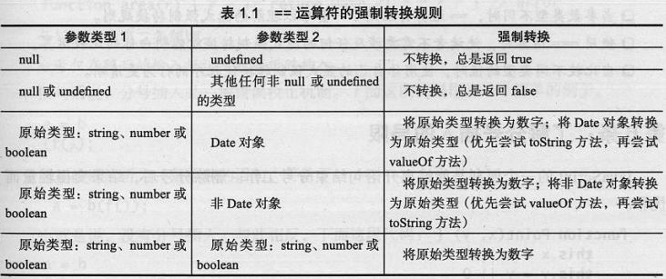

# Effective JavaScript:68 Specific Ways to Harness the Power of JavaScript
current page: P19

* 语法、形式和结构：编写合法的、符合语义的、具有意义和行为正确的而程序；
* 语用：使用语言特性构建高效程序的方法。

## 第1章 让自己习惯 JavaScript 

### 1.了解你使用的 JavaScript 版本
* ES5 引入了一种版本控制考量 - 严格模式(strict mode)。允许选择在受限制的 JavaScript 版本中禁止使用一些 JavaScript 语言中问题较多或较易于出错的特性。
> 'use strict';     // 字符串字面量(literal)
    - 只有在脚本或者函数顶部才能生效
    - 由于在连接文件上可能造成的错误，建议把此功能放在立即执行函数(Immediately Invoked Function Expression,IIFE)内部，并在函数中使用严格模式

### 2.理解 JavaScript 的浮点数
* JavaScript 只有一种数值型数据类型，其中的所有数字都是双进度浮点数，typeof 为 'number'
* 对于位运算符，JavaScript 不会直接将操作数作为浮点数进行计算，而是会将其隐式的转换为32位整数后进行计算:
    - 将操作数转换为整数
    - 使用整数位模式进行计算
    - 将结果转换为标准的 JavaScript 浮点数
* 浮点运算只能产生近似的结果，四舍五入到最接近的可表示的实数
    - 对于浮点数，结合律((x + y) + z = x + (y + z))不一定满足
    - 进行货币相关计算时，可以按比例将数值转换为最小的货币，从而进行整数计算

### 3.当心隐式的强制转换
* 算术运算符 -,*,/,% 在计算之前都会尝试将其参数转换为数字
* 运算符 + 既重载了数字加，又重载了字符串连接操作 
* 位操作符 ~,&,^,|,<<,>>,>>> 会将操作数转换为32位整数
* 结果为 null 的变量会被隐式的转换为0
* 未定义的变量会被转换为特殊的浮点数值 NaN
    - NaN 不等于其本身(可用于测试 NaN)
    - isNaN() 方法会在测试前将参数转换为数字
* 对象通过隐式的调用本身的 toString() 方法转换为字符串(例如 + 操作时)
* 对象可以通过其 valueOf() 方法转换为数字(使用 + 操作符时，会默认调用 valueOf() 方法)。因此，具有 valueOf 方法的对象应该实现 toString 方法，返回一个 valueOf 方法产生的数字的字符串表示
```JS
var obj = {
	toString: function() {
		return '2';
	},
	valueOf: function() {
		return 2;
	}
}

// + 运算符会自动调用 Object 的 valueOf 方法
var obj2 = {
    toString: function() {
        return '[object MyObject]';
    },
    valueOf: function() {
        return 17;
    }
}

'object:' + obj2
```
* 真值运算：JS 中的7个假值 - false,0,-0,'',NaN,null,undefined 
* 检查参数是否为 undefined 的方式是使用 typeof 或者与 undefined 作比较(=== undefined)

### 4.原始类型优于封装类型
* 5个原始对象：布尔值、数字、字符串、null 和 undefined
* typeof null 返回 'object'
* 标准库提供了构造函数来封装布尔值、数字和字符串作为对象。当做相等比较时，原始类型的封装对象与其原始值的行为不一样
```JS
console.log('a' === 'a');   // true
console.log(new String('a') === new String('a'));   // false
```
* 获取和设置原始类型值的属性会隐式的创建封装对象。[执行过程：每次隐式封装都会产生一个新的对象，更新封装对象并不会造成持久的影响。对原始值设置属性时没有意义的]
```JS
'hello'.someProperty = 17;
console.log('hello'.someProperty);  // undefined
```

### 5.避免对混合类型使用  == 运算符
* 使用严格相等运算符 ===：在比较操作中没有涉及任何转换
* == 运算符的强制转换规则

* 当比较不同类型的值时，使用自己的显式强制转换使代码行为更清晰

### 6.了解分号插入的局限(?)
* 自动分号插入(automatic semicolon insertion)技术是一种程序解析技术。能推断出某些上下文中省略的分号，然后有效的自动将分号插入到程序中
* 分号插入规则：
    - 分号仅在 `}` 标记之前，一个或多个换行之后和程序输入的结尾被插入。也就是说： 只能在一行、一个代码块和一段程序结束的地方省略分号
    - 分号仅在随后的输入标记不能解析时插入。也就是说，分号插入是一种错误校正机制
    - 5个字符：`(` `[` `+` `-` `/` ，每个字符都能作为一个表达式运算符或者一条语句的前缀，这依赖于具体上下文。如果下一行以这5个字符之一开始，那么不会插入分号
    - 分号不会作为分隔符在 for 循环空语句的头部被自动插入。意味着：必须在 for 循环头部显式的包含分号
* JS 中允许逗号分隔表达式。逗号分隔表达式从左到右依次执行，并返回最后一个表达式的值

### 7.视字符串为16 位的代码单元序列(?)
* Unicode：为世界上所有的文字系统的每个字符单位分配了一个唯一的整数，该整数介于0和1114111之间，在 Unicode 术语中称为代码点(code point)
* 