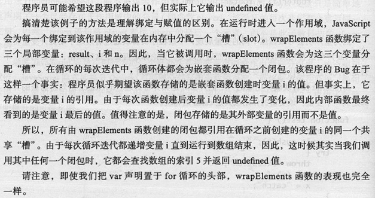

# Effective JavaScript:68 Specific Ways to Harness the Power of JavaScript

## 第2章 变量作用域

### 8.尽量少用全局变量
* JS 中很容器创建全局变量：不加任何形式的声明，而且能被整个程序的所有代码自动的访问
* 全局变量的问题：
    - 会污染共享的公共命名空间，并可能导致意外的命名冲突
    - 不利于模块化，因为会导致程序中独立组件间的不必要耦合
* 全局命名空间是 JS 程序中独立的组件进行交互的唯一途径
* JS 的全局命名空间也被暴露为在程序全局作用域中可以访问的全局对象，该对象作为 this 关键字的初始值。在 Web 浏览器中，全局对象被绑定到全局的 window 变量
```JS
var foo = 123;
console.log(this.foo);
console.log(window.foo);

this.foo = 'abc';
console.log(foo);
```
* 创建全局变量的方式：
    - 在全局作用域内使用 var 声明
    - 将变量加入到全局对象中
* 利用全局对象来做平台特性检测

### 9.始终声明局部变量
* 程序中给一个未绑定的变量赋值将会创建一个新的全局变量并赋值给它(省略 var 时会隐式的创建全局变量)

### 10.避免使用 with(?)
* with 语句的动机：程序中需要对单个对象依次调用一系列方法，使用 with 可以很方便的避免对对象的重复引用
```JS
function status(info) {
    var widget = new Widget();
    with(widget) {
        setBackground('blue');
        setForeground('white');
        setText('Status: ' + info);
        show();
    }
}

function f(x, y) {
    with(Math) {
        return min(round(x), sqrt(y));
    }
}
```

### 11.熟练掌握闭包
* 闭包的3个事实：
    - JS 允许引用在当前函数以外定义的变量
    ```JS
    function makeSandwich() {
        var magicIngredient = 'peanut butter';

        function make(filling) {
            return magicIngredient + ' and ' + filling;
        }

        return make('jelly');
    }
    makeSwidwich();
    ```
    - 即使外部函数已经返回，当前函数仍然可以引用在外部函数所定义的变量。意味着可以返回一个内部函数，并稍后调用
    > 原理：JS 的函数值包含了比调用它们时执行所需要的代码还要多的信息。而且，JS 函数值还在内部存储它们可能会引用的定义在其封闭作用域的变量。那些在其所涵盖的作用域内跟踪变量的函数被称为闭包。
    > 函数可以引用在其作用域内的任何变量，包括参数和外部函数变量。
    
    ```JS
    function makeSandwich() {
        var magicIngredient = 'peanut butter';

        function make(filling) {
            return magicIngredient + ' and ' + filling;
        }

        return make;
    }
    var f = makeSwidwich;
    f('jelly');
    f('bananas');
    f('marshmallows');
    ```
    - 闭包可以更新外部变量的值。闭包存储的是外部变量的引用，而不是值的副本。
    ```JS
    // 此方法产生了包含三个闭包的对象
    function box() {
        var val;

        return {
            set: function(newVal) { val = newVal; },
            get: function() { return val; },
            type: function() { return typeof val; }
        };
    }

    var b = box();
    b.type();
    b.set(23);
    b.get();
    b.type();
    ```
* 闭包是 JS 最优雅、最有表现力的特性之一，也是许多惯用法的核心。JS 甚至提供了一种更为方便的构建闭包的字面量语法 - 函数表达式
```JS
function sandWichMaker(magicIngredient) {
    return function(filling) {
        return magicIngredient + ' and ' + filling;
    };
}
```

### 12.理解变量声明提升
* JavaScript 支持词法作用域(lexical scoping)。除了极少的例外，对变量 foo 的引用会被绑定到声明 foo 变量最近的作用域中
* JavaScript 不支持块级作用域，即变量定义的作用域并不是离其最近的封闭语句或代码块，而是包含它们的函数
* JS 变量声明由两部分构成：声明和赋值。JS 隐式的提升(hoists)声明部分到封闭函数的顶部，而将赋值留在原地。换句话说，变量的作用域是整个函数，但仅在 var 语句出现的位置进行赋值。
* JS 中的 catch 拥有块级作用域。try...catch 语句将捕获的异常绑定到一个变量，该变量的作用域只是 catch 语句块。
```JS
function test() {
    var x = 'var', result = [];

    result.push(x);
    try {
        throw 'exceptions';
    } catch(x) {
        x = 'catch';
    }

    result.push(x);
    return result;
}
test();
```
* 可以考虑手动提升局部变量的声明，从而避免混淆(变量声明放到函数顶部)

### 13.使用立即调用的函数表达式创建局部作用域
```JS
function wrapElements(a) {
    var result = [], i, n;

    for(i =0, n = a.length; i < n; i++) {
        result[i] = function() { return a[i]; };
    }

    return result;
}
var wrapped = wrapElements([10, 20, 30, 40, 50]);
var f = wrapped[0];
f();
```

* 代码的输出结果与预期不一致的原因：(闭包通过引用而不是值来捕获它们的外部变量)



* 解决办法：通过创建一个嵌套函数并立即调用来强制创建一个局部作用域
```JS
function wrapElements(a) {
    var result = [];

    for(var i = 0, n = a.length; i < n; i++) {
        (function() {
            var j = i;
            result[i] = function() { return a[j]; };
        })();
    }

    return result;
}

function wrapElements(a) {
    var result = [];

    for(var i = 0, n = a.length; i < n; i++) {
        (function(index) {
            result[i] = function() { return a[index]; };
        })(i);
    }

    return result;
}
```

* 使用 IIFE 来创建局部作用域可能的问题：
    - 代码块不能包含任何跳出块的 break 和 continue 语句，因为在函数外使用 break 或 continue 是不合法的
    - 如果代码块引用了 this 或者 arguments 变量，IIFE 将改变它们的含义

### 14.当心命名函数表达式笨拙的作用域