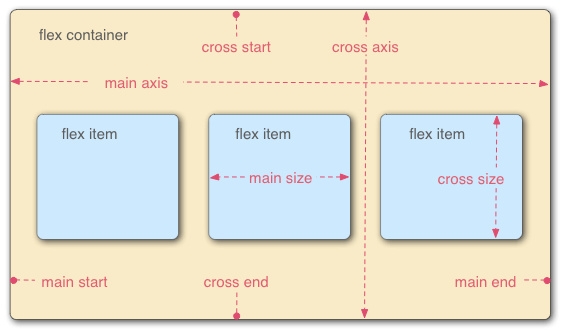

## Flex 语法

##### from：http://www.codeceo.com/article/flex-layout.html
-----------------

1.什么是 Flex 布局：   

  Flex 是 Flexible Box 的缩写，意为 "弹性布局"，用来为盒状模型提供最大的灵活性。   

  任何元素都可以指定为 Flex 布局：   

  <pre>   
  	.box { display: flex; }
  	.box { display: inline-flex; }
  	.box { display: -webkit-flex; display: flex; }
  </pre>   

  注意：<code>设为 flex 布局后，子元素的 float、clear、和 vertical-align 属性将失效。</code>

2.基本概念：   

	采用 Flex 布局的元素，称为 Flex 容器(flex container)，简称容器。它的所有子元素自动成为容器成员，称为 Flex 项目(flex item),简称项目。   

   
或者   
[点击查看采用 flex 布局的元素]('./images/flexible-box-elements.jpg')   

3.容器的属性：   

	flex-direction:决定主轴的方向，可选值-row(默认)/row-reverse/column/column-reverse[以浏览器左上角为方向];   

	flex-wrap:默认情况下，项目都排在一条线(又称主轴)上.flex-wrap 属性定义了如果一条轴线排不下，如何换行。可选值-nowrap(默认)/wrap/wrap-reverse；

	flex-flow:flex-direction 和 flex-wrap 属性的简写形式，默认值是 row nowrap。定义方式-.box { flex-flow: <flex-direction> || <flex-wrap>; }

	justify-content:

	align-items:

	align-content:   

4.

111
+222